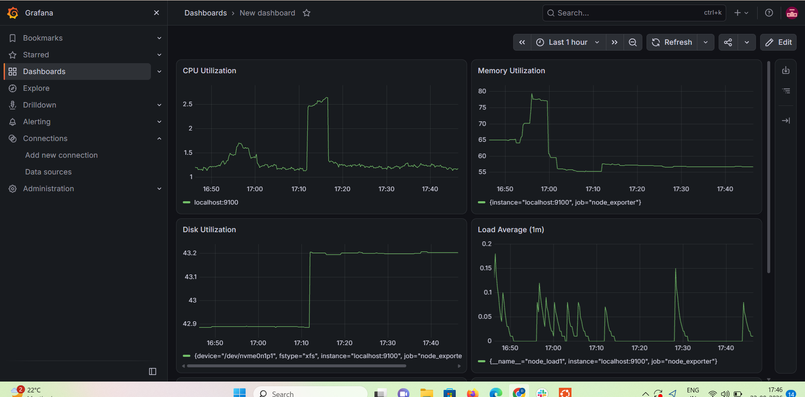
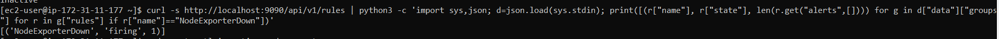
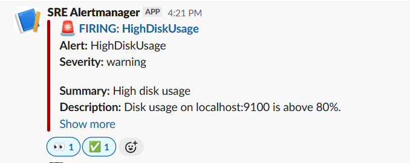
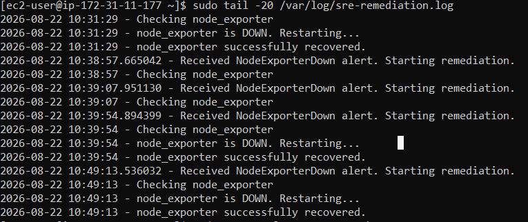
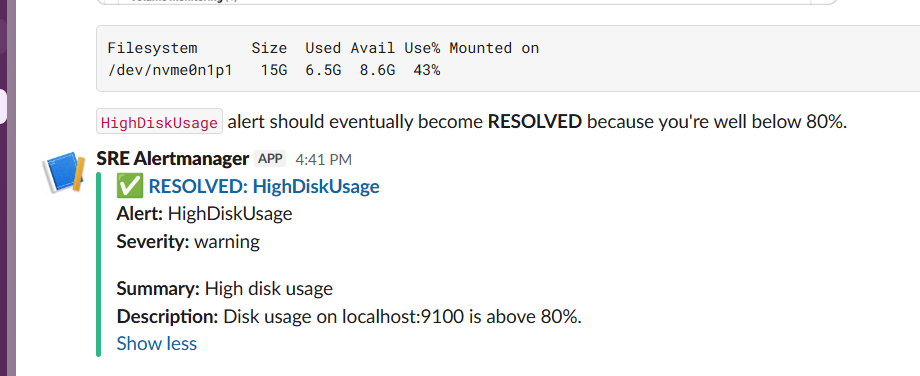

# 🚀 SRE Self-Healing Monitoring Lab

An AWS-based SRE monitoring and automated remediation lab built using
Prometheus, Node Exporter, Grafana, Alertmanager, Slack and Python.

The main objective was to build a monitoring system that can:

**Detect → Alert → Remediate → Recover → Verify**

---

## 🏗️ Architecture

```text
                    AWS EC2
                       │
        ┌──────────────┼──────────────┐
        │              │              │
        ▼              ▼              ▼
 Node Exporter     Prometheus       Grafana
    :9100             :9090           :3000
                        │
                        ▼
                  Alert Rules
                        │
                        ▼
                  Alertmanager
                     :9093
                   /        \
                  /          \
                 ▼            ▼
              Slack      Remediation
           Notification    Webhook
                              │
                              ▼
                     Python Remediation
                           :8080
                              │
                              ▼
                    Node Exporter Restart

## 📸 Project Evidence

### 1. 📊 Grafana Monitoring Dashboard



### 2. 🚨 Node Exporter Failure Detection



### 3. 🔔 Slack Alert



### 4. 🔄 Automated Self-Healing



### 5. ✅ Alert Recovery


